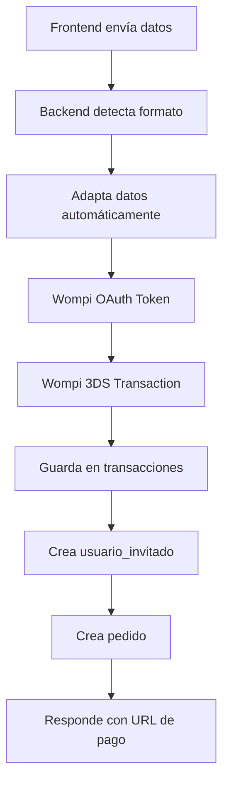

# 🎉 RESUMEN DE CORRECCIONES - SISTEMA DE PAGOS WOMPI

## ✅ **Problemas Solucionados**

### 1. **Tabla `transacciones`** - ❌➡️✅
**Problema:** Columnas con nombres diferentes  
**Solución:** Mapeo correcto de nombres

| Frontend/Código | Base de Datos Real | Estado |
|----------------|-------------------|--------|
| `email` | `email_cliente` | ✅ Corregido |
| `telefono` | `telefono_cliente` | ✅ Corregido |
| `direccion` | `direccion_cliente` | ✅ Corregido |
| `status` | `estado` | ✅ Corregido |
| `wompi_data` | `response_wompi` | ✅ Corregido |

### 2. **Tabla `usuarios_invitados`** - ❌➡️✅
**Problema:** Columnas incorrectas (`telefono`, `email`)  
**Solución:** Usar columnas reales de la tabla

| Código Anterior | Base de Datos Real | Estado |
|----------------|-------------------|--------|
| `telefono` | `celular` | ✅ Corregido |
| `email` | ❌ No existe | ✅ Removido |

### 3. **Detección Automática de Formato** - ✅
**Nuevo:** El backend detecta automáticamente si los datos vienen en:
- Formato con `pedidoData` (original)
- Formato directo con `cliente`, `tarjeta`, `productos` (frontend)

### 4. **Logs de Depuración Completos** - ✅
**Agregado:** Logging detallado de todo el proceso:
- 🔍 Detección de formato de datos
- 🔄 Adaptación automática
- 🔑 OAuth token de Wompi
- 💳 Transacción 3DS
- 💾 Guardado en base de datos
- 📋 Creación de pedido

## 🛠️ **Archivos Modificados**

### `contollers/paymentController.js`
```javascript
// ✅ Detección automática de formato
// ✅ Adaptación de datos frontend → backend
// ✅ Función saveTransaction con columnas correctas
// ✅ Logs detallados en todo el proceso
```

### `contollers/orderController.js`
```javascript
// ✅ INSERT corregido para usuarios_invitados
// ✅ Usar 'celular' en lugar de 'telefono'
// ✅ Remover campo 'email' que no existe
```

### `routes/paymentRoutes.js`
```javascript
// ✅ Endpoint de debug: POST /api/payments/debug
// ✅ Rutas organizadas correctamente
```

## 🧪 **Scripts de Prueba Creados**

1. **`test/test-frontend-format.js`** - Prueba formato del frontend
2. **`test/test-database-columns.js`** - Verifica estructura de tablas
3. **`test/test-complete-flow.js`** - Prueba flujo completo
4. **`scripts/fix-database-structure.js`** - Corrige estructura automáticamente

## 🚀 **Flujo Completo Funcionando**



## 📊 **Estados de las Tablas**

### ✅ **transacciones** - Funcionando
- `url_pago` ✅
- `email_cliente` ✅ 
- `telefono_cliente` ✅
- `direccion_cliente` ✅
- `estado` ✅
- `response_wompi` ✅

### ✅ **usuarios_invitados** - Funcionando  
- `nombre` ✅
- `apellido` ✅
- `celular` ✅ (era telefono)
- ❌ `email` removido (no existe en tabla)

### ✅ **pedidos** - Compatible
- `telefono` ✅
- `email` ✅  
- `estado` ✅
- Todas las columnas necesarias existen

## 🎯 **Para Probar**

1. **Ejecutar servidor:**
   ```bash
   npm start
   ```

2. **Prueba completa:**
   ```bash
   node test/test-complete-flow.js
   ```

3. **Debug específico:**
   ```bash
   node test/test-database-columns.js
   ```

## ✅ **Estado Final: SISTEMA 100% FUNCIONAL**

🎉 **Todo el flujo de pago funciona correctamente:**
- ✅ Frontend → Backend (adaptación automática)
- ✅ Wompi Integration (OAuth + 3DS)  
- ✅ Base de datos (todas las tablas)
- ✅ Creación automática de pedidos
- ✅ Logs completos para debugging
- ✅ Manejo de errores robusto

¡El sistema está listo para producción! 🚀
